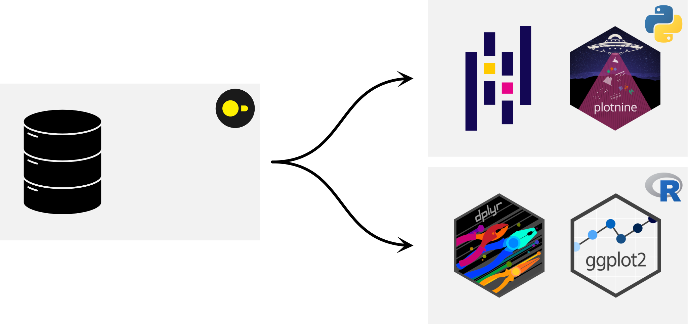
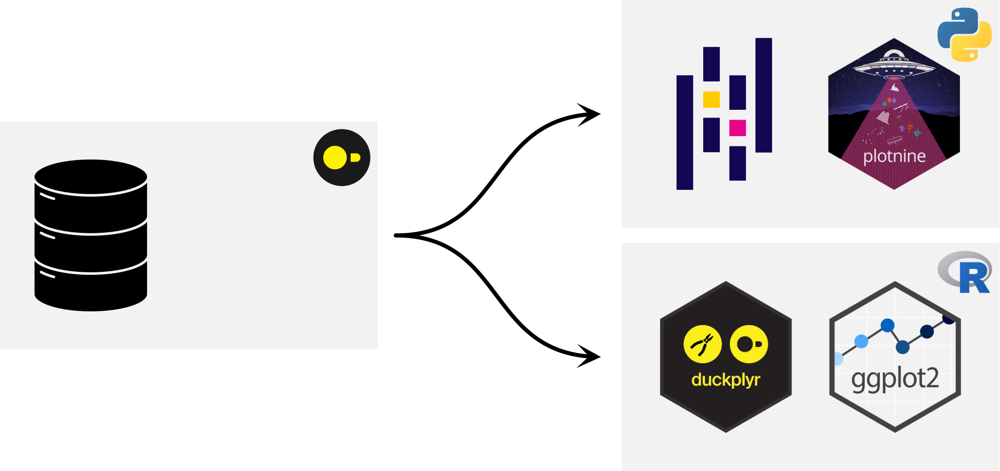
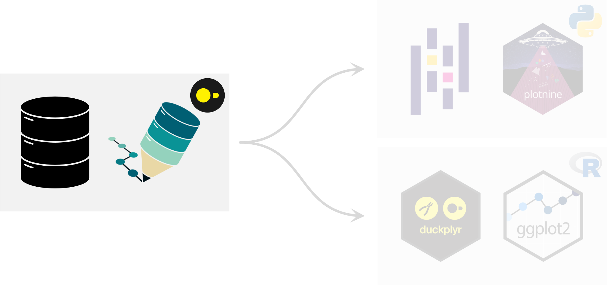
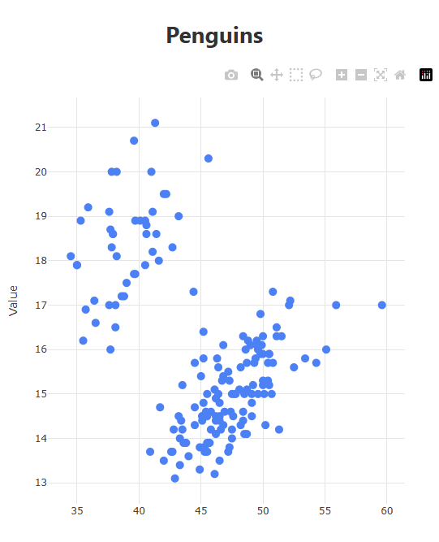
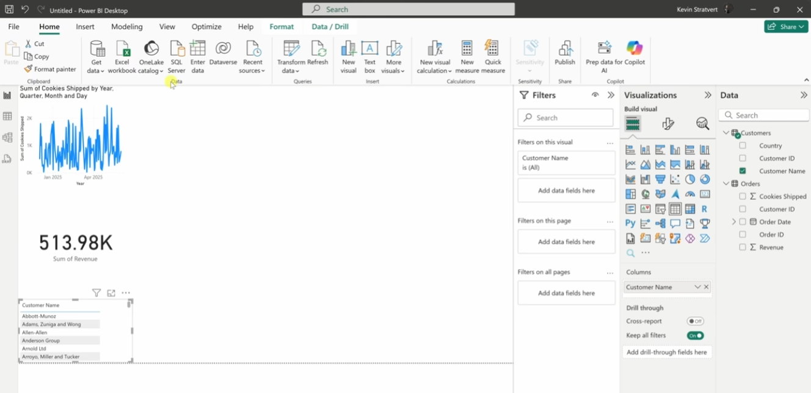
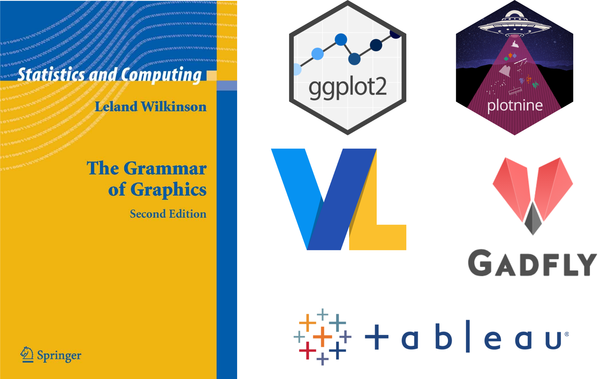
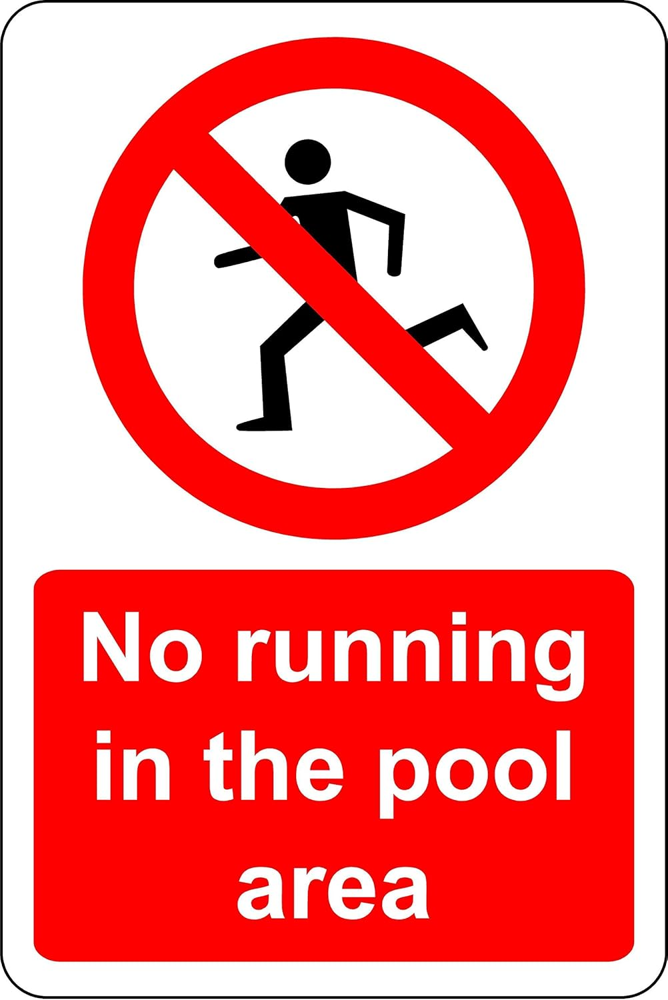

## What is ggsql?

::: {.centered}
Grammar of Graphics  
+  
Structured Query Language
{width=100%}
:::

## A quick example

```{ggsql}
#| code-line-numbers: "1-2"
SELECT * FROM 'assets/penguins.parquet'
  WHERE island == 'Biscoe'
  LIMIT 5
```

## A quick example

```{ggsql}
#| code-line-numbers: "1-2"
INSTALL ggsql FROM community;
LOAD ggsql;

SELECT * FROM 'assets/penguins.parquet'
  WHERE island == 'Biscoe'
```

## A quick example

```{ggsql}
#| code-line-numbers: "7-8"
INSTALL ggsql FROM community;
LOAD ggsql;

SELECT * FROM 'assets/penguins.parquet'
  WHERE island == 'Biscoe'

VISUALISE bill_len AS x, bill_dep AS y, species AS colour
  DRAW point
```

## {background-iframe="https://ggsql.org/" background-interactive=true}

## Why are we building this?

* 18 years of ggplot2 development
    * What works
    * What doesn't work
* Carte blanche
* SQL new terrain

## Visualisation gap



## Visualisation gap



## Visualisation gap



---

:::: {.columns}

::: {.column width="50%"}

### Visualisation gap

Alternative: A functional approach

```{.ggsql}
INSTALL miniplot FROM community;
LOAD miniplot;

SELECT 
scatter_chart(
  list(bill_len),
  list(bill_dep),
  'Penguins'
) 
FROM 'assets/penguins.parquet'
WHERE island == 'Biscoe';
```

:::

::: {.column width="50%"}



:::

::::

## Visualisation gap

Alternative: Closed source point and click BI tools



## Grammar of Graphics



---

:::: {.columns}

::: {.column}

#### SQL

* Declarative
    * Information structures
    * 'Give revenue grouped by month'
* Compositional
    * select, group by, where
* Portable execution
    * DuckDB, PostgreSQL, MySQL

:::

::: {.column}

#### Grammar of graphics

* Declarative
    * Information encodings
    * 'Show revenue as bars by month'
* Compositional
    * layer, scales, facets
* Portable execution
    * ggplot2, Vega-Lite, plotnine

:::

::::

{style="height:30vh; width:auto; display:block; margin:auto;"}

---

:::: {.columns}

::: {.column}

### No runtime

* Distribution of executable
* No bundling of R/python
* Sandboxed scope
* Variety of integrations
    * DuckDB extension, CLI, Jupyter kernel

:::

::: {.column}

{style="height:50vh; width:auto"}

:::

::::

---

:::: {.columns}

### LLM-tooling

::: {.column}
* Assistants well-versed in SQL
    * Resembles structured natural language
    * Declarative
    * Small core grammar
    * Short context
* LLMs as interface for data visualisation
    * [QueryChat](https://posit-dev.github.io/querychat/)
* [ggsql skill](https://github.com/posit-dev/skills/blob/main/ggsql/ggsql/SKILL.md)
:::

::: {.column}

:::

::::

---

:::: {.columns}

::: {.column}

### How does it work?

* User query
    * Tree sitter
    * AST
* Reader
    * Query DB
    * Computed summaries
* Writer
    * JSON spec (Vega-Lite)
    * Future work

:::

::: {.column}

:::

::::

## Minard example


## Minard example

```{ggsql}
#| code-line-numbers: "1"
SELECT * FROM 'assets/minard_troops.csv' 
LIMIT 5
```

---

```{ggsql}
#| code-line-numbers: "2-3"
#| output-location: column
SELECT * FROM 'assets/minard_troops.csv' 
VISUALISE long AS x, lat AS y
  DRAW path
```

---

```{ggsql}
#| code-line-numbers: "4"
#| output-location: column
SELECT * FROM 'assets/minard_troops.csv' 
VISUALISE long AS x, lat AS y
  DRAW path
    PARTITION BY direction, group
```

---

```{ggsql}
#| code-line-numbers: "4"
#| output-location: column
SELECT * FROM 'assets/minard_troops.csv' 
VISUALISE long AS x, lat AS y
  DRAW path
    MAPPING direction AS stroke
    PARTITION BY direction, group
```

---

```{ggsql}
#| code-line-numbers: "4"
#| output-location: column
SELECT * FROM 'assets/minard_troops.csv' 
VISUALISE long AS x, lat AS y
  DRAW path
    MAPPING direction AS stroke, survivors AS linewidth
    PARTITION BY direction, group
```

---

```{ggsql}
#| code-line-numbers: "6-7"
#| output-location: column
SELECT * FROM 'assets/minard_troops.csv' 
VISUALISE long AS x, lat AS y
  DRAW path
    MAPPING direction AS stroke, survivors AS linewidth
    PARTITION BY direction, group
  SCALE stroke TO ('burlywood', 'black')
    RENAMING 'A' => 'Advance', 'R' => 'Retreat'
```

---

```{ggsql}
#| code-line-numbers: "8"
#| output-location: column
SELECT * FROM 'assets/minard_troops.csv' 
VISUALISE long AS x, lat AS y
  DRAW path
    MAPPING direction AS stroke, survivors AS linewidth
    PARTITION BY direction, group
  SCALE stroke TO ('burlywood', 'black')
    RENAMING 'A' => 'Advance', 'R' => 'Retreat'
  SCALE linewidth FROM (0, null) TO (0, 20)
```

---

```{ggsql}
#| code-line-numbers: "6-8"
#| output-location: column
SELECT * FROM 'assets/minard_troops.csv' 
VISUALISE long AS x, lat AS y
  DRAW path
    MAPPING direction AS stroke, survivors AS linewidth
    PARTITION BY direction, group
  DRAW text
    MAPPING city AS label FROM 'assets/minard_cities.csv'
    SETTING fontsize => 6
  SCALE stroke TO ('burlywood', 'black')
    RENAMING 'A' => 'Advance', 'R' => 'Retreat'
  SCALE linewidth FROM (0, null) TO (0, 20)
```

---

```{ggsql}
#| code-line-numbers: "1,10-11"
#| output-location: column
LOAD spatial;
SELECT * FROM 'assets/minard_troops.csv' 
VISUALISE long AS x, lat AS y
  DRAW path
    MAPPING direction AS stroke, survivors AS linewidth
    PARTITION BY direction, group
  DRAW text
    MAPPING city AS label FROM 'assets/minard_cities.csv'
    SETTING fontsize => 6
  PROJECT x, y TO orthographic
    SETTING origin => (30, 55)
  SCALE stroke TO ('burlywood', 'black')
    RENAMING 'A' => 'Advance', 'R' => 'Retreat'
  SCALE linewidth FROM (0, null) TO (0, 20)
```

---

```{ggsql}
#| code-line-numbers: "4-6"
#| output-location: column
LOAD spatial;
SELECT * FROM 'assets/minard_troops.csv' 
VISUALISE long AS x, lat AS y
  DRAW spatial MAPPING FROM 'assets/countries.parquet'
    SETTING fill => 'cornsilk'
    FILTER continent == 'Europe'
  DRAW path
    MAPPING direction AS stroke, survivors AS linewidth
    PARTITION BY direction, group
  DRAW text
    MAPPING city AS label FROM 'assets/minard_cities.csv'
    SETTING fontsize => 6
  PROJECT x, y TO orthographic
    SETTING origin => (30, 55)
  SCALE stroke TO ('burlywood', 'black')
    RENAMING 'A' => 'Advance', 'R' => 'Retreat'
  SCALE linewidth FROM (0, null) TO (0, 20)
```

---

```{ggsql}
#| code-line-numbers: "15"
#| output-location: column
LOAD spatial;
SELECT * FROM 'assets/minard_troops.csv' 
VISUALISE long AS x, lat AS y
  DRAW spatial MAPPING FROM 'assets/countries.parquet'
    SETTING fill => 'cornsilk'
    FILTER continent == 'Europe'
  DRAW path
    MAPPING direction AS stroke, survivors AS linewidth
    PARTITION BY direction, group
  DRAW text
    MAPPING city AS label FROM 'assets/minard_cities.csv'
    SETTING fontsize => 6
  PROJECT x, y TO orthographic SETTING 
    origin => (30, 55), 
    bounds => (-500000, -150000, 500000, 150000)
  SCALE stroke TO ('burlywood', 'black')
    RENAMING 'A' => 'Advance', 'R' => 'Retreat'
  SCALE linewidth FROM (0, null) TO (0, 20)
```

---

```{ggsql}
#| code-line-numbers: "19-25"
#| output-location: column
LOAD spatial;
SELECT * FROM 'assets/minard_troops.csv' 
VISUALISE long AS x, lat AS y
  DRAW spatial MAPPING FROM 'assets/countries.parquet'
    SETTING fill => 'cornsilk'
    FILTER continent == 'Europe'
  DRAW path
    MAPPING direction AS stroke, survivors AS linewidth
    PARTITION BY direction, group
  DRAW text
    MAPPING city AS label FROM 'assets/minard_cities.csv'
    SETTING fontsize => 6
  PROJECT x, y TO orthographic SETTING 
    origin => (30, 55), 
    bounds => (-500000, -150000, 500000, 150000)
  SCALE stroke TO ('burlywood', 'black')
    RENAMING 'A' => 'Advance', 'R' => 'Retreat'
  SCALE linewidth FROM (0, null) TO (0, 20)
  LABEL
    title => 'Napoleon\'s Russian Campaign',
    subtitle => 'Inspired by the graphic of C.J. Minard',
    linewidth => 'Troops',
    stroke => 'Direction'
```


## Get yours today

* [ggsql.org](https://ggsql.org/) interactive example
    * language support ([Positron](https://positron.posit.co/) / VS Code)
    * kernel for Jupyter and [Quarto](https://quarto.org/)
    * command line interface
    * [R](https://r.ggsql.org/)/[python](https://pypi.org/project/ggsql/) wrappers
    * [WebAssembly](https://www.npmjs.com/package/ggsql-wasm)

```{.ggsql}
INSTALL ggsql FROM community;
LOAD ggsql;
```

## In closing

* New SQL-based tool for data visualisation
* Based on declarative grammar of graphics
* DuckDB is first citizen

## Thank you!

<!-- Mention Thomas, George, Hadley -->
<!-- Mention Posit -->