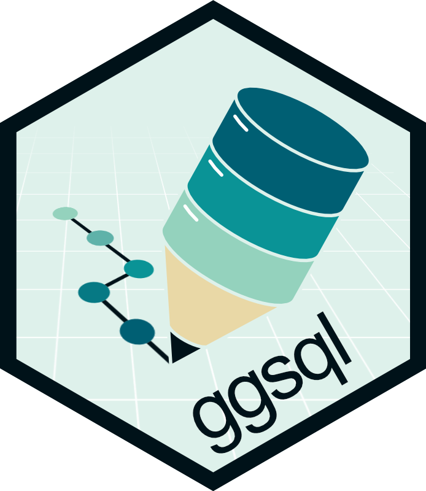

## {background-color="#DEF1EB"}

### **ggsql:**<br>**A grammar of graphics for SQL**

Teun van den Brand  
DuckCon #7, Amsterdam  
2026-06-24

:::r-stack
{width="400"}
:::

## What is ggsql?

::: {.centered}
Grammar of Graphics  
+  
Structured Query Language
{width=100%}
:::

## A quick example {auto-animate=true}

```{ggsql}
#| code-line-numbers: "1-2"
SELECT * FROM 'assets/penguins.parquet'
  WHERE island == 'Biscoe'
```

## A quick example {auto-animate=true}

```{ggsql}
#| code-line-numbers: "1-2"
INSTALL ggsql FROM community;
LOAD ggsql;

SELECT * FROM 'assets/penguins.parquet'
  WHERE island == 'Biscoe'
```

## A quick example {auto-animate=true}

```{ggsql}
#| code-line-numbers: "7-8"
INSTALL ggsql FROM community;
LOAD ggsql;

SELECT * FROM 'assets/penguins.parquet'
  WHERE island == 'Biscoe'

VISUALISE bill_len AS x, bill_dep AS y
  DRAW point
```

## A quick example {auto-animate=true}

```{ggsql}
#| code-line-numbers: "9"
INSTALL ggsql FROM community;
LOAD ggsql;

SELECT * FROM 'assets/penguins.parquet'
  WHERE island == 'Biscoe'

VISUALISE bill_len AS x, bill_dep AS y
  DRAW point
  DRAW smooth
```

## A quick example

```{ggsql}
#| code-line-numbers: "7"
INSTALL ggsql FROM community;
LOAD ggsql;

SELECT * FROM 'assets/penguins.parquet'
  WHERE island == 'Biscoe'

VISUALISE bill_len AS x, bill_dep AS y, species AS colour
  DRAW point
  DRAW smooth
```

## {background-iframe="https://ggsql.org/" background-interactive=true}

## ggplot2 is most popular visualisation method in R

* 18 years of ggplot2 development
* Constrained by backward compatibility
* ggsql is carte blanche for new ideas

```{ggsql}
#| echo: false
SELECT count / 1000000.0 AS millions, * FROM 'assets/cranlogs.parquet'
VISUALISE date AS x, millions AS y, package AS stroke
  DRAW line
  SCALE stroke 
    FROM ('ggplot2', 'Rcpp', 'jsonlite', 'plotly', 'tinyplot')
    TO ('red', 'darkgrey', 'dimgray', 'grey', 'gainsboro')
  SCALE y RENAMING * => '{:num}M'
  LABEL
    y => 'Montly Downloads',
    x => null,
    stroke => 'Package'
```

## Grammar of Graphics


## Why are we building **this**?


## Why are we building **this**?


## Why are we building **this**?


---

:::: {.columns}

::: {.column width="50%"}

### Why are we not building that?

A functional approach

```{.ggsql}
INSTALL miniplot FROM community;
LOAD miniplot;

SELECT 
scatter_chart(
  list(bill_len),
  list(bill_dep),
  'Penguins'
) 
FROM 'assets/penguins.parquet'
WHERE island == 'Biscoe'
```

:::

::: {.column width="50%"}


:::

::::

## Why are we not building that?

Closed source point and click BI tools


---

:::: {.columns}

::: {.column}

#### SQL

* Declarative
    * Information structures
    * 'Give revenue grouped by month'
* Compositional
    * select, group by, where
* Portable execution
    * DuckDB, PostgreSQL, MySQL

:::

::: {.column}

#### Grammar of graphics

* Declarative
    * Information encodings
    * 'Show revenue as bars by month'
* Compositional
    * layer, scales, facets
* Portable execution
    * ggplot2, Vega-Lite, plotnine

:::

::::

{style="height:30vh; width:auto; display:block; margin:auto;"}

---

:::: {.columns}

::: {.column}

### How does it work?

* User query
    * Tree sitter
    * AST
* Reader
    * Query DB
    * Computed summaries
* Writer
    * JSON spec (Vega-Lite)
    * Future work

:::

::: {.column}

{style="height:70vh; width:auto;"}

:::

::::

## Minard example


## Minard example

```{ggsql}
#| code-line-numbers: "1"
SELECT * FROM 'assets/minard_troops.csv' 
LIMIT 5
```

## {auto-animate=true auto-animate-unmatched=false}

```{ggsql}
#| code-line-numbers: "2-3"
#| output-location: column
SELECT * FROM 'assets/minard_troops.csv' 
VISUALISE long AS x, lat AS y
  DRAW path
```

## {auto-animate=true auto-animate-unmatched=false}

```{ggsql}
#| code-line-numbers: "4"
#| output-location: column
SELECT * FROM 'assets/minard_troops.csv' 
VISUALISE long AS x, lat AS y
  DRAW path
    PARTITION BY direction, group
```

## {auto-animate=true auto-animate-unmatched=false}

```{ggsql}
#| code-line-numbers: "4"
#| output-location: column
SELECT * FROM 'assets/minard_troops.csv' 
VISUALISE long AS x, lat AS y
  DRAW path
    MAPPING direction AS stroke
    PARTITION BY direction, group
```

## {auto-animate=true auto-animate-unmatched=false}

```{ggsql}
#| code-line-numbers: "6"
#| output-location: column
SELECT * FROM 'assets/minard_troops.csv' 
VISUALISE long AS x, lat AS y
  DRAW path
    MAPPING 
      direction AS stroke, 
      survivors AS linewidth
    PARTITION BY direction, group
```

## {auto-animate=true auto-animate-unmatched=false}

```{ggsql}
#| code-line-numbers: "8-9"
#| output-location: column
SELECT * FROM 'assets/minard_troops.csv' 
VISUALISE long AS x, lat AS y
  DRAW path
    MAPPING 
      direction AS stroke, 
      survivors AS linewidth
    PARTITION BY direction, group
  SCALE stroke TO ('burlywood', 'black')
    RENAMING 'A' => 'Advance', 'R' => 'Retreat'
```

## {auto-animate=true auto-animate-unmatched=false}

```{ggsql}
#| code-line-numbers: "10"
#| output-location: column
SELECT * FROM 'assets/minard_troops.csv' 
VISUALISE long AS x, lat AS y
  DRAW path
    MAPPING 
      direction AS stroke, 
      survivors AS linewidth
    PARTITION BY direction, group
  SCALE stroke TO ('burlywood', 'black')
    RENAMING 'A' => 'Advance', 'R' => 'Retreat'
  SCALE linewidth FROM (0, null) TO (0, 20)
```

## {auto-animate=true auto-animate-unmatched=false}

```{ggsql}
#| code-line-numbers: "8-10"
#| output-location: column
SELECT * FROM 'assets/minard_troops.csv' 
VISUALISE long AS x, lat AS y
  DRAW path
    MAPPING 
      direction AS stroke, 
      survivors AS linewidth
    PARTITION BY direction, group
  DRAW text
    MAPPING city AS label FROM 'assets/minard_cities.csv'
    SETTING fontsize => 6
  SCALE stroke TO ('burlywood', 'black')
    RENAMING 'A' => 'Advance', 'R' => 'Retreat'
  SCALE linewidth FROM (0, null) TO (0, 20)
```

## {auto-animate=true auto-animate-unmatched=false}

```{ggsql}
#| code-line-numbers: "1,12-13"
#| output-location: column
LOAD spatial;
SELECT * FROM 'assets/minard_troops.csv' 
VISUALISE long AS x, lat AS y
  DRAW path
    MAPPING 
      direction AS stroke, 
      survivors AS linewidth
    PARTITION BY direction, group
  DRAW text
    MAPPING city AS label FROM 'assets/minard_cities.csv'
    SETTING fontsize => 6
  PROJECT x, y TO mercator
    SETTING origin => (30, 55)
  SCALE stroke TO ('burlywood', 'black')
    RENAMING 'A' => 'Advance', 'R' => 'Retreat'
  SCALE linewidth FROM (0, null) TO (0, 20)
```

## {auto-animate=true auto-animate-unmatched=false}

```{ggsql}
#| code-line-numbers: "4-6"
#| output-location: column
LOAD spatial;
SELECT * FROM 'assets/minard_troops.csv' 
VISUALISE long AS x, lat AS y
  DRAW spatial MAPPING FROM 'assets/countries.parquet'
    SETTING fill => 'cornsilk'
    FILTER continent == 'Europe'
  DRAW path
    MAPPING 
      direction AS stroke, 
      survivors AS linewidth
    PARTITION BY direction, group
  DRAW text
    MAPPING city AS label FROM 'assets/minard_cities.csv'
    SETTING fontsize => 6
  PROJECT x, y TO mercator
    SETTING origin => (30, 55)
  SCALE stroke TO ('burlywood', 'black')
    RENAMING 'A' => 'Advance', 'R' => 'Retreat'
  SCALE linewidth FROM (0, null) TO (0, 20)
```

## {auto-animate=true auto-animate-unmatched=false}

```{ggsql}
#| code-line-numbers: "15"
#| output-location: column
LOAD spatial;
SELECT * FROM 'assets/minard_troops.csv' 
VISUALISE long AS x, lat AS y
  DRAW spatial MAPPING FROM 'assets/countries.parquet'
    SETTING fill => 'cornsilk'
    FILTER continent == 'Europe'
  DRAW path
    MAPPING 
      direction AS stroke, 
      survivors AS linewidth
    PARTITION BY direction, group
  DRAW text
    MAPPING city AS label FROM 'assets/minard_cities.csv'
    SETTING fontsize => 6
  PROJECT x, y TO albers
    SETTING origin => (30, 55)
  SCALE stroke TO ('burlywood', 'black')
    RENAMING 'A' => 'Advance', 'R' => 'Retreat'
  SCALE linewidth FROM (0, null) TO (0, 20)
```

## {auto-animate=true auto-animate-unmatched=false}

```{ggsql}
#| code-line-numbers: "15"
#| output-location: column
LOAD spatial;
SELECT * FROM 'assets/minard_troops.csv' 
VISUALISE long AS x, lat AS y
  DRAW spatial MAPPING FROM 'assets/countries.parquet'
    SETTING fill => 'cornsilk'
    FILTER continent == 'Europe'
  DRAW path
    MAPPING 
      direction AS stroke, 
      survivors AS linewidth
    PARTITION BY direction, group
  DRAW text
    MAPPING city AS label FROM 'assets/minard_cities.csv'
    SETTING fontsize => 6
  PROJECT x, y TO orthographic
    SETTING origin => (30, 55)
  SCALE stroke TO ('burlywood', 'black')
    RENAMING 'A' => 'Advance', 'R' => 'Retreat'
  SCALE linewidth FROM (0, null) TO (0, 20)
```

## {auto-animate=true auto-animate-unmatched=false}

```{ggsql}
#| code-line-numbers: "17"
#| output-location: column
LOAD spatial;
SELECT * FROM 'assets/minard_troops.csv' 
VISUALISE long AS x, lat AS y
  DRAW spatial MAPPING FROM 'assets/countries.parquet'
    SETTING fill => 'cornsilk'
    FILTER continent == 'Europe'
  DRAW path
    MAPPING 
      direction AS stroke, 
      survivors AS linewidth
    PARTITION BY direction, group
  DRAW text
    MAPPING city AS label FROM 'assets/minard_cities.csv'
    SETTING fontsize => 6
  PROJECT x, y TO orthographic SETTING 
    origin => (30, 55), 
    bounds => (-500000, -150000, 500000, 150000)
  SCALE stroke TO ('burlywood', 'black')
    RENAMING 'A' => 'Advance', 'R' => 'Retreat'
  SCALE linewidth FROM (0, null) TO (0, 20)
```

## {auto-animate=true auto-animate-unmatched=false}

```{ggsql}
#| code-line-numbers: "21-27"
#| output-location: column
LOAD spatial;
SELECT * FROM 'assets/minard_troops.csv' 
VISUALISE long AS x, lat AS y
  DRAW spatial MAPPING FROM 'assets/countries.parquet'
    SETTING fill => 'cornsilk'
    FILTER continent == 'Europe'
  DRAW path
    MAPPING 
      direction AS stroke, 
      survivors AS linewidth
    PARTITION BY direction, group
  DRAW text
    MAPPING city AS label FROM 'assets/minard_cities.csv'
    SETTING fontsize => 6
  PROJECT x, y TO orthographic SETTING 
    origin => (30, 55), 
    bounds => (-500000, -150000, 500000, 150000)
  SCALE stroke TO ('burlywood', 'black')
    RENAMING 'A' => 'Advance', 'R' => 'Retreat'
  SCALE linewidth FROM (0, null) TO (0, 20)
  LABEL
    title => 'Napoleon\'s Russian Campaign',
    subtitle => 'Inspired by the graphic of C.J. Minard',
    linewidth => 'Troops',
    stroke => 'Direction'
```


---

:::: {.columns}

::: {.column}

### Works wherever

* Distributed as standalone executable
* No bundling of R/Python
* Constrained execution
* Variety of integrations
    * DuckDB extension, CLI, Jupyter kernel

:::

::: {.column}

{style="height:50vh; width:auto"}

:::

::::

---

:::: {.columns}

### LLM-tooling

::: {.column}
* Assistants well-versed in SQL
    * Resembles structured natural language
    * Declarative
    * Small core grammar
    * Short context
* LLMs as interface for data visualisation
    * [QueryChat](https://posit-dev.github.io/querychat/)
* [ggsql skill](https://github.com/posit-dev/skills/blob/main/ggsql/ggsql/SKILL.md)
:::

::: {.column}

:::

::::

## Get yours today

Goal:  
*Available wherever SQL is*

* [ggsql.org](https://ggsql.org/) interactive example
    * language support ([Positron](https://positron.posit.co/) / VS Code)
    * kernel for Jupyter and [Quarto](https://quarto.org/)
    * command line interface
    * [R](https://r.ggsql.org/)/[Python](https://pypi.org/project/ggsql/) wrappers
    * [WebAssembly](https://www.npmjs.com/package/ggsql-wasm)
* DuckDB extension:

```{.ggsql}
INSTALL ggsql FROM community;
LOAD ggsql;
```

## In closing

* New SQL-based tool for data visualisation
* Based on declarative grammar of graphics
* DuckDB is a first-class citizen

:::r-stack
{width="400"}
:::

## Thank you!


Posit PBC:

* Thomas Lin Pedersen
* George Stagg
* Hadley Wickham
